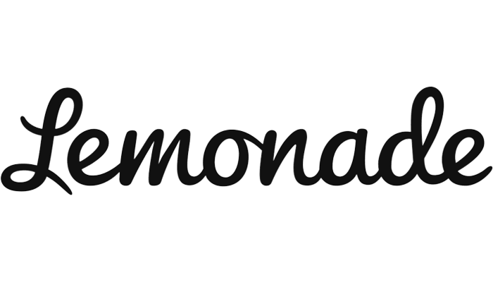

# FinTech Case Study
 
## Overview and Origin

* **Name of company**\
Lemonade, Inc.

* **When was the company incorporated?**\
April 2015

* **Who are the founders of the company?**\
Daniel Schreiber (former president of Powermat Technologies), Shai Wininger (co-founder of Fiverr) and Ty Sagalow

* **How did the idea for the company (or project) come about?**\
Schreiber and Wininger, both veterans of running start-ups and eager for a new opportunity, met in 2015. Schreiber was considering opportunities in the insurance field because he assumed the age-old industry was ripe for disruption. After meeting Wininger, who happened to be a coding and design whiz, the two began drawing out what their millennial-focused user would want to see in an insurance company (i.e. user friendly, non-human based interaction, quick and transparent transactions, etc.).

* **How is the company funded? How much funding have they received?**\
In its infancy, Lemonade was funded by early seed investors including Sequoia Capital and Aleph who in 2015 lent the company $13 million dollars. By April 2017, the company had raised around $180 million in multiple funding rounds and by April 2019 another $300 million. In July 2020 Lemonade went public and currently (July 2021) its enterprise value is estimated at $4.1 billion.
## Business Activities:

* **What specific financial problem is the company or project trying to solve?**\
Lemonade saw the old insurance model as fraught with confusing products, hidden fees, frustrating claim processing times, and questionable ethics. In order to solve this they wanted to design an easy to use interface with chatbot customer support and artificial intelligence to create a better customer experience and establish cost savings. Unlike some of their competitors at the time, they didn't sell policy of other insurers, but instead wrote the policies themselves in hopes of giving them more flexibility and as an effort to increase revenue and profit margins. Further, they saw the old guard as less transparent in how it chooses to deny and accept claims and a public that was skeptical of the industry. Because of this they chose to only accept 25% of revenue for covering administration expenses and hopefully generating a profit, while using the other 75% to pay claims and if there was anything leftover, donate this income to charities of the customers' choosing. 

* **Who is the company's intended customer?  Is there any information about the market size of this set of customers?**\
Schreiber, the CEO, is quoted as saying "every person in the nation, in the world, needs insurance." In that vein, you would be safe to assume that everyone in the world is Lemonade's customer and that is true. However, the focus for Lemonade is the younger generation. Their entire business plan and especially front-end design is centered on what an ideal insurer would look like&mdash; from a Millennial's point of view. Currently Lemonade operates only in France and the United States. For some perspective there are about 209 million adults in the U.S. and about 68 million adults in France. There are 72 million and 13 million Millennials in the U.S. and France, respectively. Obviously that is quite a large potential customer base and with only a few tech-savvy competitors and a current market share of only 0.1% of the homeowners and renters insurance markets combined, that likely spells more growth for Lemonade. 

* **What solution does this company offer that their competitors do not or cannot offer? (What is the unfair advantage they utilize?)**\
Lemonade's primary advantage is ease of use. Allowing the end user to instantly get product quotes via smartphone or PC along with the added benefit of almost lightning-fast claim distribution speaks to this ethos. Just as with many financial technology firms, Lemonade is leveraging its technology (AI, machine learning, chatbots, etc.) to add to this customer experience while at the same time reducing overhead. To add to that, the company saw a need for a more trustworthy insurer and promises to donate extra profit to charity. To separate itself even further from other insurtech competitors Lemonade chose to write all their policies as a traditional insurance company would in order to provide more flexibility.

* **Which technologies are they currently using, and how are they implementing them? (This may take a little bit of sleuthing–– you may want to search the company’s engineering blog or use sites like Stackshare to find this information.)**\
In a broader sense, some of the technologies Lemonade is implementing are machine learning, artificial intelligence, and cross-platform access. Some of the applications they are using to implement this are Python, NGINX, CloudFlare, TypeScript, Ruby, Swift, Go, OpenResty, Shell, Google Analytics, Mixpanel, Mandrill, Segment, Docker, WordPress, G Suite, and Medium. 

## Landscape:

* **What domain of the financial industry is the company in?**\
Insurance. More specifically, Insurtech. 

* **What have been the major trends and innovations of this domain over the last 5-10 years?**\
Since the advent of the internet and especially since the tech boom of the late 90s insurance companies have worked to make their products available online. However, bogged down by the relative complexity and variety of products these companies struggled to make all their products comparable and immediately quotable in this fashion. With the recent advancement in AI and machine learning technologies as well as the increasing use of smartphones and apps over traditional web browsers, insurtech companies like Lemonade have made the same policies and products available but increased to comparability, user experience, and speed at which this information can be obtained.

* **What are the other major companies in this domain?**\
Other major companies in the Insurtech domain include Next Insurance, Zipari, MetroMile, Corvus Insurance, Kin Insurance, Policygenius, Clearcover, Savvy, Ethos, bolttech, and Hippo. 

## Results

* **What has been the business impact of this company so far?**\
The impact of Lemonade, aside from its growth of market share in the insurance industry, has been the establishment of an entirely new type of business model&mdash; an insurance company focused on trust. This trust is derived from the fact that Lemonade only takes a flat fee for every insurance. Any of the surplus that is not claimed then goes to the charity of the customer's choice. I believe this will change the industry and will force traditional insurance companies to adapt to a similar model, in which transparency and trust are valued. Lemonade's customer base, skewed younger, is particular weary of the vague nature in which claims can be denied or accepted. Using this type of model provides some reassurance that companies, although incentivized to maximize profit, can also work to their customers' interests. In 2016 Lemonade hired Duke Professor Dan Ariely as their Chief Behavioral Officer. In an interview with TechCrunch he stated, "People feel justified in trying to screw up an insurance company... dishonesty is influenced a lot by our ability to justify it. If we are dealing with a party that we think is immoral itself than we [are immoral] and justify it. We think that everybody else cheats… it feels like a victimless crime.” This quote epitomizes Lemonade's philosophy and this type of business will undoubtedly have an impact on the growth potential of this company, but also the insurance industry as a whole.

* **What are some of the core metrics that companies in this domain use to measure success? How is your company performing, based on these metrics?**\
Some of the most important metrics in the insurance and insurtech industries are In Force Premium (IFP), Gross Loss Ratio (GLR), and Gross Earned Premium (GEP). Also important are Premium Per Customer and Total Customers. In Q1 of 2021 Lemonade had an IFP, GLR, and GEP of $252M, 121%, and $56M respectively. On a YoY basis Lemonade produced an IFP, GLR, and GEP of 89%, 25%, and 84%, respectively. In Q1 of 2021 Lemonade has a $229 premium for customer and 1,096,618 total customers. These two metrics increased 25% YoY and 50% YoY, respectively. Using these metrics it is clear to see Lemonade's growth is substantial. Lemonade has continued to show growth in these core metrics, while also investing heavily into growth and the introduction of new products.

* **How is your company performing relative to competitors in the same domain?**\
Lemonade's top competitors in the insurtech field include Cover, Slice Labs, Zelros, and Spixii. Lemonade, which was founded in 2015, has, by far, produced the most growth in this field. With 567 employees and a ~5 billion valuation, it is the largest insurtech company in existence. Cover, Slice Labs, Zelros, and Spixii have 87, 49, 51, and 8 employees currently. All of these competitors are private and while valuation is hard to ascertain, total funding for these companies combined is $78.7 million. Lemonade was able to raise $480 million in private capital in the few years after establishing themselves.

## Recommendations

* **If you were to advise the company, what products or services would you suggest they offer? (This could be something that a competitor offers, or use your imagination!)**\
I believe Lemonade has a solid AI product in their proprietary "Maya" chatbot and this, along with their existing stack of software, would be apt for expansion into other insurance products. Currently Lemonade offers renters insurance, homeowners insurance, pet insurance, and term life insurance. There are currently a myriad of additional insurance products that are offered by the traditional insurance industry that may be advantageous for Lemonade to offer. These include: employee benefits (i.e. group health, group personal accident, group business travel) and commercial lines of insurance (i.e. director and officers liability, workers compensation, product liability, etc.). 

* **Why do you think that offering this product or service would benefit the company?**\
As the younger generation that is targeted by Lemonade gains trust in Lemonade and this new insurtech business model they will be apt as new customers for these products. Additionally, the ease of use and quick response and claim fulfilment times will provide an added benefit for existing customers in these insurance products. 

* **What technologies would this additional product or service utilize?**\
Lemonade could leverage their existing infrastructure and technologies to take advantage of providing more insurance products. The company would need to adapt the AI to encompass the necessary questions and ascertain the appropriate risks. Having shown they have done this effectively for the non-commercial consumer I have no reason to believe it wouldn't translate to the commercial industry.

* **Why are these technologies appropriate for your solution?**\
Aside from adapting the AI, Lemonade would need to update their machine learning algorithms and consult with industry insiders within the field of commercial insurance. Further, they would need to create risk models which would allow them to accurately and competitively price the products. Lemonade would also need to insure they have enough capital on hand to meet industry-regulated requirements and had licenses to sell these products in any particular domain they wished to. Lemonade would then need to market and make these products available on all their platforms and continue to provide their same standard of business. 

## Sources

* https://lemonade.com
* https://en.wikipedia.org/wiki/Lemonade,_Inc.
* https://www.forbes.com/sites/jeffkauflin/2019/05/02/lemonade-fintech-insurance-unicorn/?sh=1d37eb776cde
* https://finance.yahoo.com/quote/LMND?p=LMND&.tsrc=fin-srch
* https://www.infoplease.com/us/census/demographic-statistics
* https://www.indexmundi.com/france/demographics_profile.html
* https://www.statista.com/statistics/797321/us-population-by-generation/#:~:text=Millennials%20were%20the%20largest%20generation,the%20population%20for%20many%20years.
* https://www.statista.com/statistics/1125651/number-millennials-population-france/
* https://stackshare.io/lemonade/lemonade
* https://builtin.com/fintech/insurtech-companies
* https://www.mckinsey.com/industries/financial-services/our-insights/insurtech-the-threat-that-inspires
* https://www.investopedia.com/terms/i/insurtech.asp
* https://productmint.com/the-lemonade-insurance-business-model-how-does-lemonade-insurance-make-money/
* https://seekingalpha.com/article/4429101-lemonade-naysayers-utterly-wrong
* https://craft.co/lemonade/competitors

